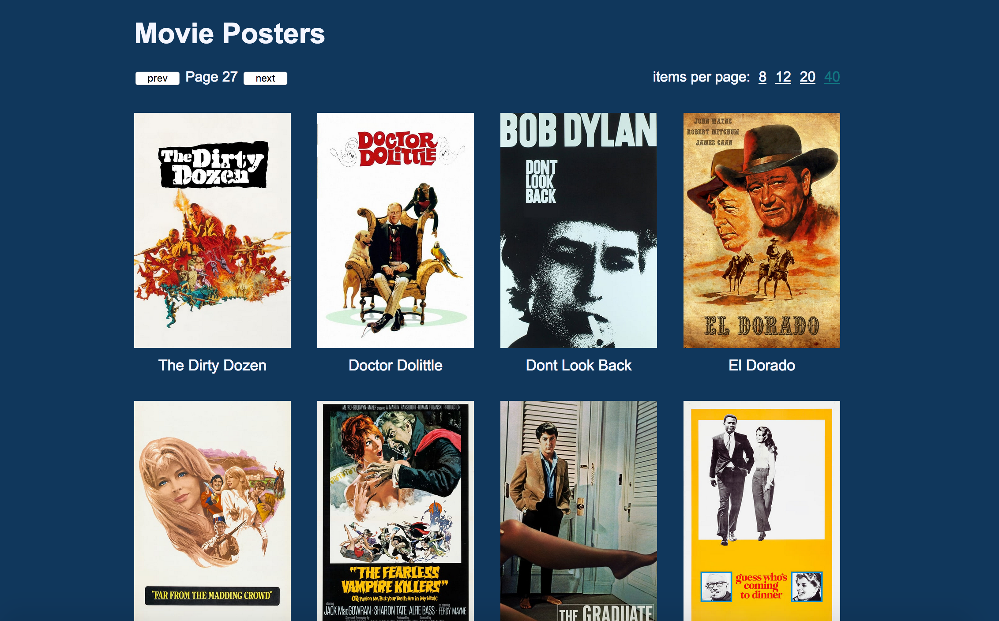
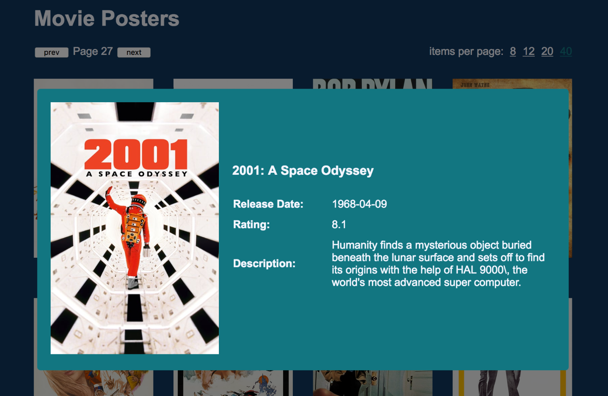

# techniposter

Techniposter is a movie poster database with a web interface that I created for an university course (lab) on functional programming. This exploratorive project is mostly written using Clojure. The backend with an HTTP API uses the [luminus framework](https://luminusweb.com/), while the frontend is a React app written in ClojureScript with the [re-frame framkework](https://github.com/day8/re-frame).

### Backend
The movie poster data (movie metadata and links to poster images) was sourced from [TMBd's API](https://developers.themoviedb.org/). The data is saved in a H2 in-memory database. API endpoints were created with the help of Swagger, which includes a neat web interface to test and debug endpoints.

### Frontend
For the frontend, which is a single page application, the re-frame framework is used. It utilizes the reagent React wrapper, thus React components can be defined and constructed using the functional capabilities of ClojureScript.

